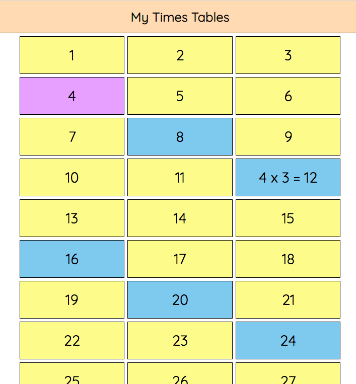

# Multiples

This is a very basic multiplication app built with JavaScript. It has been built based on the following brief requirements:

## Brief
See the brief [here](BRIEF.md).

## Preview
[danwarman-multiples.netlify.app](https://danwarman-multiples.netlify.app/) *(Last checked: 9/06/20 18:00)*



# Summary
## How to use
Pressing a number button will highlight all of the multiples of the number you have selected. 

You can then press the highlighted button to reveal the sum.

>***For example:***
>
>If you press the number **4**, all the multiples of **4** (*8, 12, 16, 20, 24, 28, etc...*) will be highlighted.
>
>If you then press the number **24**, it will show the sum: **4 x 6 = 24**.

### Each number button can be one of **three** colours:
* **Yellow**: 
  * This is the default colour for a button. It means that it has not been pressed and/or that it is not a multiple of the pressed button.

* **Purple**:
  * When you click/tap a **yellow** button it will become this colour to show that it is active - the number you wish to find multiples of.

* **Blue**:
  * If a **purple** button is active, all buttons where the number is a multiple of the **purple** button will be *highlighted* by becoming **blue**. 

>***For example:***
>
>If you press the number **4**, the button will become **purple**. You'll also notice that all the multiples of **4** (*8, 12, 16, 20, 24, 28, etc...*) have become **blue**.


## Outstanding / Considerations
// TODO

*Notes:**
* Jest - Testing
* Refactor JS
* Config for extensibility eg. numbers in grid (12^), items per row per breakpoint
* Performance and Accessibility beyond dyslexia-friendly colours

# Installation
## Clone project
Via your command line tool, navigate to the root of your 'sites' directory. This will be the location you store your projects.

Paste the following command and hit `enter`.

```
git clone git@github.com:danwarman/multiples.git
```

## Go in to the project
Via your command line tool, navigate into the root of the multiples project.
```
cd multiples
```

## Install the app
In order to install the app, you will require `npm`.

`npm` is a node package manager. You must ensure you have both `Node.js` and `npm` installed in order to install the app.

### Check you have `node.js` and `npm` installed
To check if you have `node.js` installed, run the following command.
```
node -v
```
To check if you have `npm` installed, run the following command.
```
npm -v
```

For instructions on how to install these if they're missing, go to [npmjs.com/get-npm](https://www.npmjs.com/get-npm).

### Installing the app
Run the following command.
```
npm install
```

# Run the app
## Production mode
```
npm run build:prod
```

This produces a `public` directory containing the compiled/transpiled files.
* The Sass is compiled and bundled in to a single file: `/css/app.bundle.css`
* The JavaScript is transpiled with Babel and minified in to bundled file: `/js/app.bundle.js`
* The HTML is copied in to the directory with the respective tags injected for the CSS and JS.

Opening the following file in browser will allow you to use the production version of app: `/public/index.html`.

## Dev mode
```
npm run start:dev
```
This will run the `webpack-dev-server` per the dev config. It will open the application in the browser on an available localhost port.

In this mode, you can make changes to the code which, on save, will retrigger webpack and hot reload in the browser.